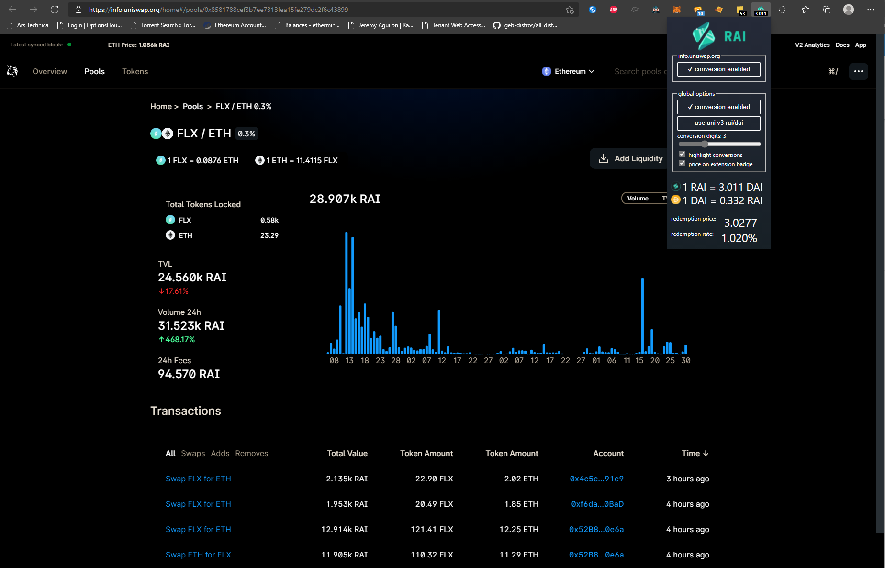

# RAI is money

This is a chrome extension offering real time fiat and stablecoin to RAI currency conversion and replacement on the page.  

Learn more about RAI at https://reflexer.finance/

## Dependencies
None! Pure JS.

Any Chromium based browser is supported.

## Installation
### Store - currently version 0.4
Add from the [chrome web store listing.](https://chrome.google.com/webstore/detail/rai-is-money/efedgnjpkdppihmkeapeloadceipmjfb)

### Manual Installation - currently version 0.5
- [download the repository](https://github.com/testguid/RAI-is-money/archive/refs/heads/main.zip)
- extract
- navigate to chrome://extensions/ or edge://extensions/
  - enable developer mode
  - load unpacked and point to the extension folder ex: \downloads\RAI is money 

## Release Notes
### 0.5
Significantly increased speed and stability by not running the regex on elements like script or style. Fixed redemption rate display. 

### 0.4
Added conversion price display. Added conversion formatting feature. UI tweaks.

### 0.3
Submission for the second bounty!

### 0.2
Better initial experience for the badge price (it will appear after first page load rather than after 30 minutes or extension menu interaction).

### 0.1
Initial commit.

## Features and Examples
- fiat and stablecoin -> RAI conversion
    - Document traversal and observation to catch every relevant price.
      - watches all text nodes and reacts to any changes
      - watches nodes newly added to the document - example [zapper](https://zapper.fi/dashboard) or scrolling through a comments section
      - is able to convert values which span multiple nodes - example [daistats](https://daistats.com/#/oracles) 
   - Robust regex which matches many common and uncommon cases.
      - US $1 - example [ebay](https://www.ebay.com/itm/203174246738)
      - suffixes like $100k, 100k USD, $22m - example [uniswap](https://info.uniswap.org/home#/pools/0xcb0c5d9d92f4f2f80cce7aa271a1e148c226e19d)
      - supports dollar signs or indicators before or after the amount
      - easily disabled if it ends up causing issues on the page
- Supports additional crypto and fiat conversions. These conversions are based on the optimal and accurate RAI price route through uni v3 rai/dai. The target is priced in DAI and then into RAI.
- Toggle the extension or site block list and conversions revert in real time, no refresh needed.
- Supports spaces, commas, and dots as thousands separators. Supports commas and dots as decimal points. The conversions are rendered using the same style as the original text.
- Conversions have the same decimal places as source text, except if the conversion would round to 0 in which case 1 decimal point is used.

- Extension badge always shows the RAI price. Updates every 30 minutes.
  - All prices are cached so conversion begins as soon as the page loads in - no request latency.

- Open the extension menu for easy access to options.
  - Select between redemption price or uni v3 rai/dai price.
  - Disable conversion for the current site or all sites.
  - More settings for highlight, badge price.

